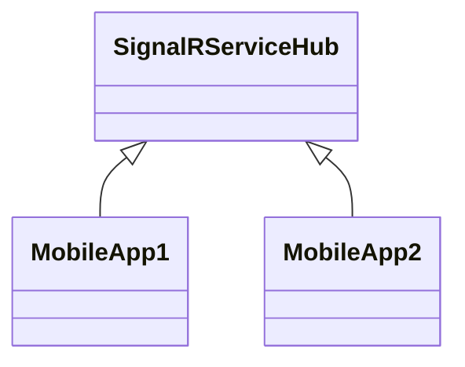

# Summary

SignalRServiceHub is a [ASP.NET](http://ASP.NET) web service that forwards [SignalR](https://learn.microsoft.com/en-us/aspnet/signalr/overview/getting-started/introduction-to-signalr) connections between different Clients. The service was created to enable the communication between Mobile-Apps (e.g. [Blazor Progressive Web Application](https://learn.microsoft.com/en-us/aspnet/core/blazor/progressive-web-app)).



This allows now the exchange Realtime data between the MobileApp1 and MobileApp2. The most popular sample is a Chat application that allows a group chat between several Mobile phones (like WhatsApp). Checkout [this](https://learn.microsoft.com/en-us/aspnet/core/blazor/tutorials/signalr-blazor) tutorial for more information.

# Project creation tutorial

This sections describes how this  project was created. If you want to use SignalR in our project and are new to the .NET world, this could be a good starting point. 

1. Download Visual Studio 2022 Community Edition
2. When install Visual Studio, make sure that you select “ASP.NET and web development”
3. Open “developer command prompt” by typing this to the Windows Search bar
4. Create a directory for your source code repositories: `mkdir userprofile%\source\repos`
5. Change to this directory: `cd %userprofile%\source\repos`
6. Create an empty web project: `dotnet new web --name SignalRServiceHub` 
7. Change the directory to the project folder: `cd SignalRServiceHub`
8. Optionally I would recommend to use [Git](https://git-scm.com/) to track your changes in the project:
    1. Install Git: `winget install --id Git.Git -e --source winget`
    2. Restart the “developer command prompt” and change to the current directory again
    3. Configure git:
        
        `git config --global user.email "[you@example.com](mailto:you@example.com)"`
        
        `git config --global [user.name](http://user.name/) "Your Name"`
        
    4. Initialize Git: `git init`
    5. Create a .gitignore: `dotnet new gitignore`
    6. Add files to Staging area: `git add .`
    7. Commit the changes: 
    `git commit -m "Project created with: dotnet new web --name SignalRServiceHub"`
9. Add a new folder Hubs: `mkdir Hubs`
10. Add the ServiceHub.cs to the `Hubs` folder
11. Optionally you can add and commit this file to git: 
`git add Hubs\ServiceHub.cs && git commit -m "ServiceHub.cs added"`
12. Replace the file Program.cs in the root folder in order to permit [Cross-Origin Resource Sharing](https://developer.mozilla.org/en-US/docs/Web/HTTP/CORS)
13. Replace the file Properties/launchSettings.json to tell Visual Studio that we don’t want to lunch a browser window on startup.
14. Optionally you can commit this to git as well: 
`git commit -a -m "Permit Cross-Origin Resource Sharing in Program.cs"`
15. Build the project: `dotnet build`
16. Open the project in Visual Studio: `devenv SignalRServiceHub.csproj`
17. Start the project by pressing the green Play Button (https). This should open a black window where you dan see some log output saying that the Service is running. The Service now is waiting for clients to connect. To test it with an Client App, have a look to the BlazorPwaAgentX.
18. After closing Visual Studio, it will ask you to create a solution file, say yes.
19. Optionally you can add and commit it to Git:
`git add SignalRServiceHub.sln && git commit -m "add SignalRServiceHub.sln"`
20. Optionally you can add and push the project to [github](https://github.com/): 
    1. Create a free account on github for free by using the “Sign up” on [https://github.com/](https://github.com/)
    2. Create a new repository “SignalRServiceHub" on github. **NOTE: To pervent merge conflict, it is very important to NOT initialize it with a README, .gitignore, or license.**
    3. Add the project to the remote repo in the “developer command prompt” with:
    `git remote add origin <your-repository-URL>`
    4. The remote branch is main, the local is master, so we need to: `git branch -M main`
    5. Push the local changes to GitHub: `git push -u origin main`

# Deploy the Service on Microsoft Azure Cloud

In order to access the SignalRServiceHub via Internet, it needs to be running on a server that is accessible via internet. With some restrictions, Microsoft Azure Cloud offers this for free. This section describes how to deploy the Service on Microsoft Azure Cloud:

1. Prepare Microsoft Azure:
    1. [Create an Azure account for free](https://azure.microsoft.com/free/dotnet)
    2. Go to the [Azure Portal](https://portal.azure.com/)
    3. Press open the “Hamburger” Menu and select “+ Create a resource”
    4. Click on “Web App → Create”
    5. Fill in the necessary details like subscription, resource group, and app name. Choose the runtime stack (e.g., .NET 8.0) and the region.
    6. NOTE: Make sure that you enable **Authentication settings, this is required for deployment from Visual Studio**
2. **Publish from Visual Studio**:
    - Open your ASP.NET project in Visual Studio.
    - Right-click on the project in Solution Explorer and select “Publish”.
    - In the Publish dialog, select “Azure” and then “Next”.
    - Choose “Azure App Service (Windows)” or “Azure App Service (Linux)” based on your preference, and click “Next”.
    - Sign in with your Azure credentials if prompted.
    - You should see the Azure Entry we have crated in step 1, select it an press Finish
    - Close the Wizzard
3. Back in Visual Studio, you see now “SignalRServiceHub - Web Deploy.pubxml”. Press the “Publish” button to publish it.
    - Visual Studio will build and deploy your application to Azure.
    - You can monitor the deployment progress in the Output window.
    - Once the deployment is complete, Visual Studio will provide a link to your live web app.
    - [For more detailed instructions, you can refer to the official Microsoft documentation1](https://learn.microsoft.com/en-us/azure/app-service/quickstart-dotnetcore)[2](https://learn.microsoft.com/en-us/aspnet/core/host-and-deploy/azure-apps/?view=aspnetcore-8.0).
4. The link [https://signalrservicehub.azurewebsites.net/](https://signalrservicehub.azurewebsites.net/) can now be configured in the Client app, e.g. BlazorPawAgentX in app.razor:
    
    ```jsx
    @code{
        public const string ServiceHubUrl = "https://signalrservicehub.azurewebsites.net/servicehub";
    }
    ```
